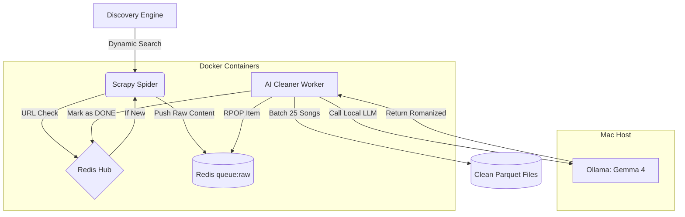
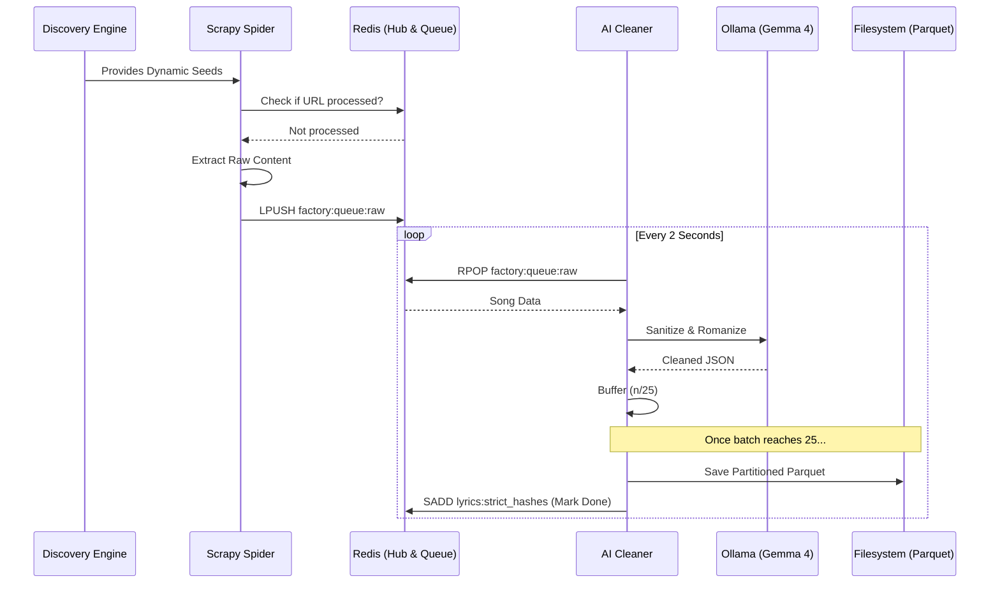
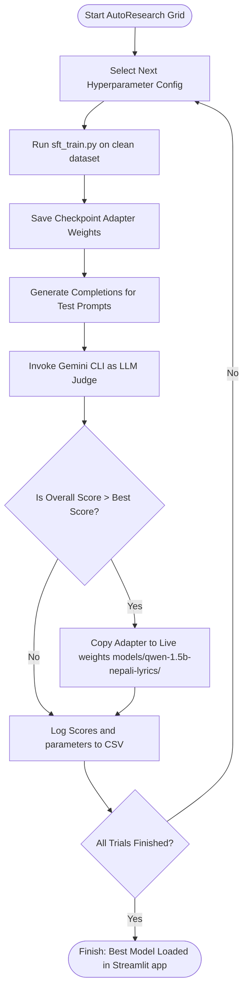

# 🎵 Resilient AI-Data Factory (Nepali Lyrics)

A high-scale, resilient pipeline for discovering, scraping, and AI-sanitizing millions of Nepali lyrics. Optimized for Mac M3 Pro (18GB) using **Gemma 4** and **Redis**.

## 🏗️ Architecture Visualization



## 🔄 Information Flow Sequence



---

## 🧪 AutoResearch Optimization Loop



---

## 🚀 Quick Start

### 1. Prerequisites
- **Docker:** For Redis persistence.
- **Ollama:** Running `gemma4:e4b`.
- **Python 3.13+**

### 2. Installation
```bash
python3 -m pip install -r requirements.txt
docker-compose up -d
```

### 3. Launch the Factory
```bash
python3 main.py
```
This will start the Orchestrator, the AI Cleaner, and the Scraper simultaneously.

---

## 🛠 Configuration (`factory/config.py`)

You can control the factory behavior by creating or editing `factory/config.py`:

| Setting | Default | Description |
| :--- | :--- | :--- |
| `STORAGE_LIMIT_GB` | `5` | Pauses scraper when local raw data hits this limit. |
| `REVIEW_MODE` | `False` | If True, pauses after each song for manual terminal approval. |
| `MAX_SONGS` | `None` | Stop the factory after reaching this many verified songs. |
| `MODEL` | `gemma4:e4b` | The Ollama model used for sanitization. |

---

## 🔍 Debugging & Monitoring

### 📊 View Real-time Stats
```bash
PYTHONPATH=. python3 factory/report_gen.py
```
Shows verified song counts, script distribution (Romanized vs Devanagari), and top domains.

### 🛑 Safe Stopping & Pausing
- **Graceful Shutdown:** Press `Ctrl+C` in the `main.py` terminal. The Orchestrator will signal all components to stop safely.
- **Manual Pause:** You can pause the pipeline via Redis without stopping the containers:
  ```bash
  docker exec nep-lyricist-redis-1 redis-cli set factory:signal PAUSE
  ```
- **Resume:** 
  ```bash
  docker exec nep-lyricist-redis-1 redis-cli set factory:signal RUNNING
  ```
- **Automatic Pause:** The system automatically pauses if:
  - Disk space is < 2GB.
  - Ollama connection is lost.
  - The `MAX_SONGS` limit is reached.

---

## 🕒 Scraping Lifecycle & Monitoring

### How long does it run?
- **Discovery Phase:** 5-15 minutes (Parsing sitemaps and building the queue).
- **Scraping Phase:** Ongoing until all prioritized links are processed or `MAX_SONGS` is reached.
- **Cleanup Phase:** 30 seconds after the spider stops to flush final buffers.

### Notifications & Progress
- **Logs:** Monitor real-time scraping and AI sanitization:
  ```bash
  docker-compose logs -f factory
  ```
- **Real-time Stats:** Run the report generator for a high-level overview:
  ```bash
  python3 factory/report_gen.py
  ```
- **Redis Inspection:** Check the count of unique songs discovered:
  ```bash
  docker exec nep-lyricist-redis-1 redis-cli SCARD lyrics:strict_hashes
  ```

### 📂 Data Structure
- **Redis (`factory:queue:raw`):** High-speed buffer for incoming raw content.
- `data/lyrics_clean/`: AI-sanitized, enriched, and partitioned songs.
- `data/lyrics_clean/source_domain=.../`: Data partitioned by domain for optimal ML training and HF streaming support.

---

## 🧠 Model Training & Optimization (Local Qwen-2.5)

Once you compile the dataset (using `python3 factory/export_dataset.py`), you can train the Qwen-1.5B model locally on Apple Silicon (MPS).

### 1. Start Training
To start fine-tuning:
```bash
PYTHONPATH=. python3 training/sft_train.py --batch_size 1 --epochs 3
```

To enable **Completion-Only prefix-masked loss** (which masks the prompts and only calculates gradients on the actual completed lyric tokens, improving grammar):
```bash
PYTHONPATH=. python3 training/sft_train.py --batch_size 1 --epochs 3 --completion_only
```

To configure custom LoRA capacity (e.g., rank 16 and alpha 32):
```bash
PYTHONPATH=. python3 training/sft_train.py --batch_size 1 --epochs 3 --lora_r 16 --lora_alpha 32
```

### 2. Autonomous Hyperparameter Tuning (AutoResearch)
We have implemented a Karpathy-style **AutoResearch** ratchet loop that automatically runs training trials across various hyperparameters, generates test completions, grades them using the local `gemini` CLI, and keeps the best-performing checkpoints:

* **Run a Quick Verification Trial:**
  ```bash
  PYTHONPATH=. python3 factory/autoresearch.py --quick_test
  ```
* **Run Full Grid Search:**
  ```bash
  PYTHONPATH=. python3 factory/autoresearch.py
  ```
The best trial checkpoint is automatically copied to the live model weights path (`models/qwen-1.5b-nepali-lyrics/`).

### 3. Monitoring & Resuming from Interruption
Checkpoints are saved locally under `models/qwen-1.5b-nepali-lyrics/` at the end of every epoch. 
To resume from where you left off, simply run:
```bash
PYTHONPATH=. python3 training/sft_train.py --batch_size 1 --epochs 3 --resume
```

---

## 🎨 Interactive Evaluation Playground

We have created a Streamlit application to test and rate completions:
```bash
streamlit run factory/playground_app.py
```
* **Local GPU Caching:** The app loads your best fine-tuned LoRA model directly onto Apple Silicon (MPS) and caches it. The first autocomplete takes 10-15 seconds to load, while subsequent responses are generated instantly.
* **Model Toggle:** Toggle between your local fine-tuned Qwen model (recommended) and the Ollama API fallback from the sidebar.
* **Feedback Logging:** All ratings, prompt metrics, and edited lyric overrides are saved to `logs/user_feedback.db` for subsequent active learning loops.

